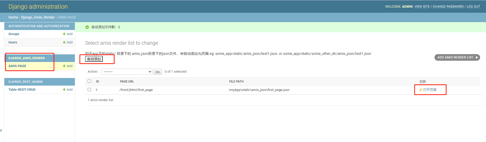

# django_amis_render
a django app to render amis json file to web.

amis version:1.3.4


install:
    ```
	pip install django_amis_render
    ```

usage:

1. added in settings.py INSTALLED_APPS:
    ```
	'django_amis_render',
	```
2. add url in urls.py:

```
from django.urls import path,include

urlpatterns = [
    path('admin/', admin.site.urls),
    path('front/', include('django_amis_render.urls')) <<--add this line
]
```

3. add amis json file in your apps:
  eg:
  ```
  my_project----my_project
                  |
                  |
                  --------settings.py
                  --------urls.py
            ----myRenderApp     <----this is your app
                  |
                  ---------static
                             |
                             ----amis_json
                                   |
                                   --------first_page.json
                                   --------second_page.json
								   
	```

4. make sure the myRenderApp is in settings.py INSTALLED_APPS:
    ```
	INSTALLED_APPS = [
    'django.contrib.admin',
    'django.contrib.auth',
    'django.contrib.contenttypes',
    'django.contrib.sessions',
    'django.contrib.messages',
    'django.contrib.staticfiles',
    'myRenderApp',
]
```

5. login admin page: http://127.0.0.1:8000/admin/
   find DJANGO_AMIS_RENDER---AMIS-PAGE
   press "自动添加"/"AUTOADD".
   
6. if tips: to urls to myRenderApp.
   set projects urls.py. add this line:
   path('render/', include('myRenderApp.urls'))
   
7. finish.
   the page will be shown below.
   press open /打开页面 will open the page.
   

  


